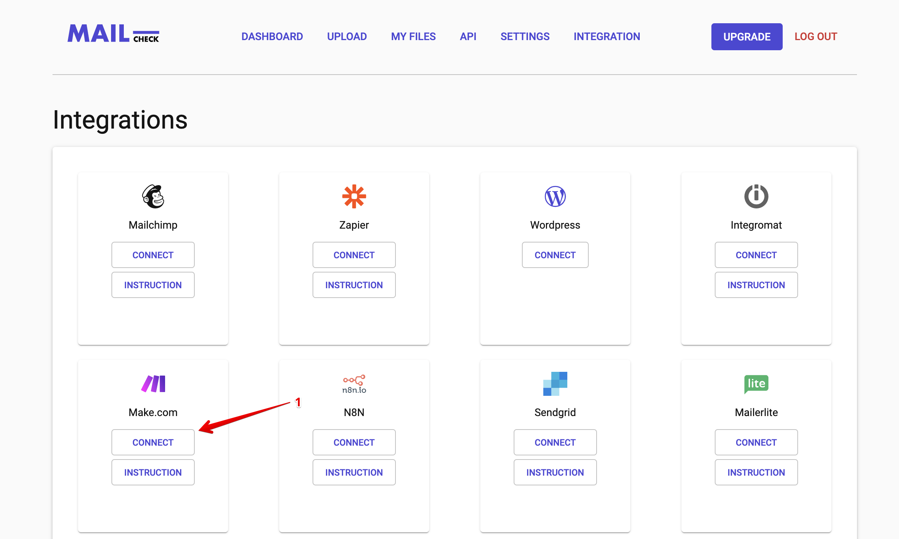
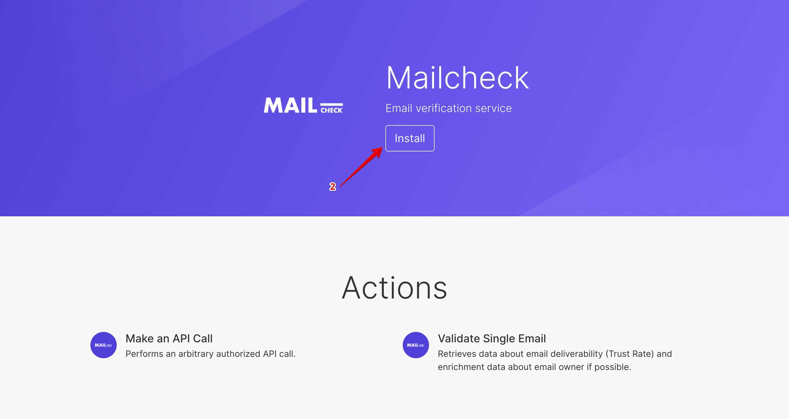
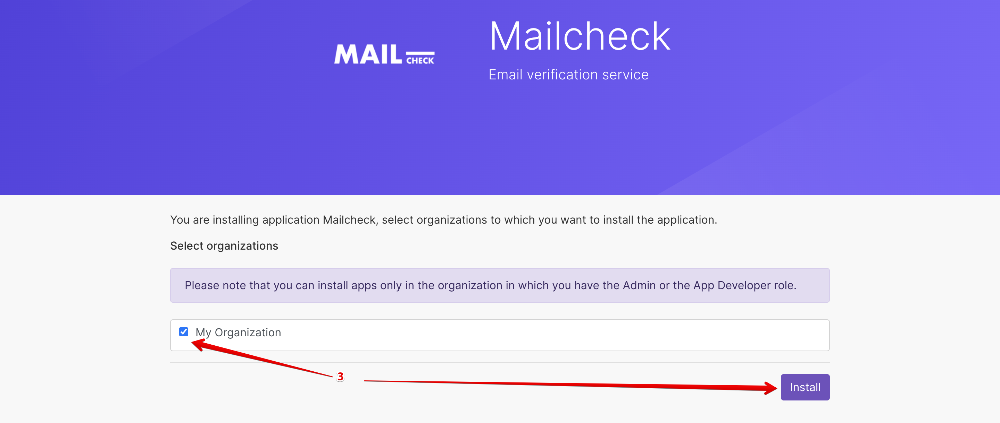
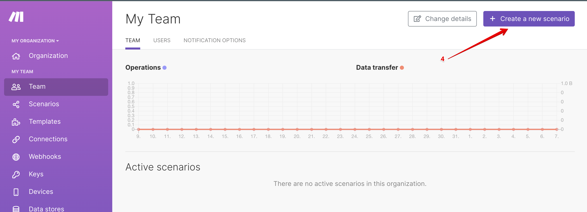
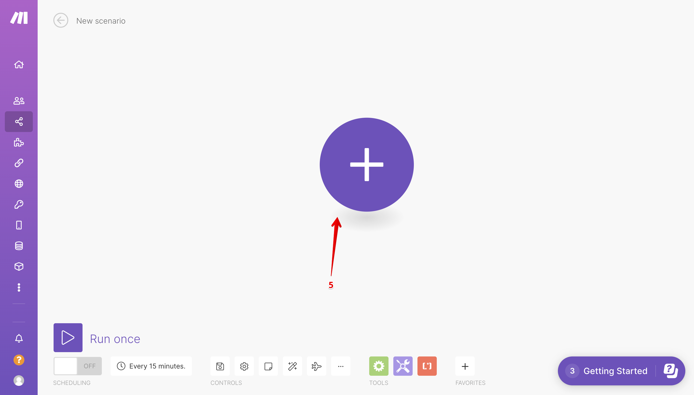
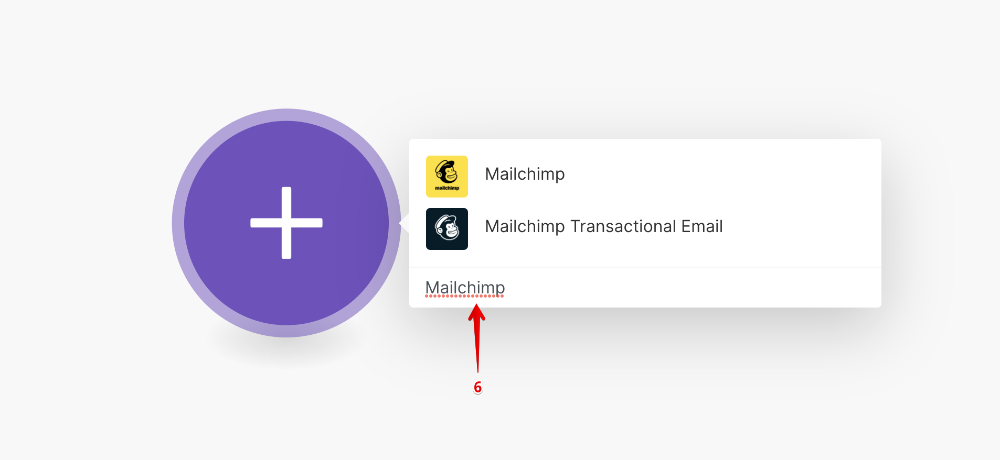
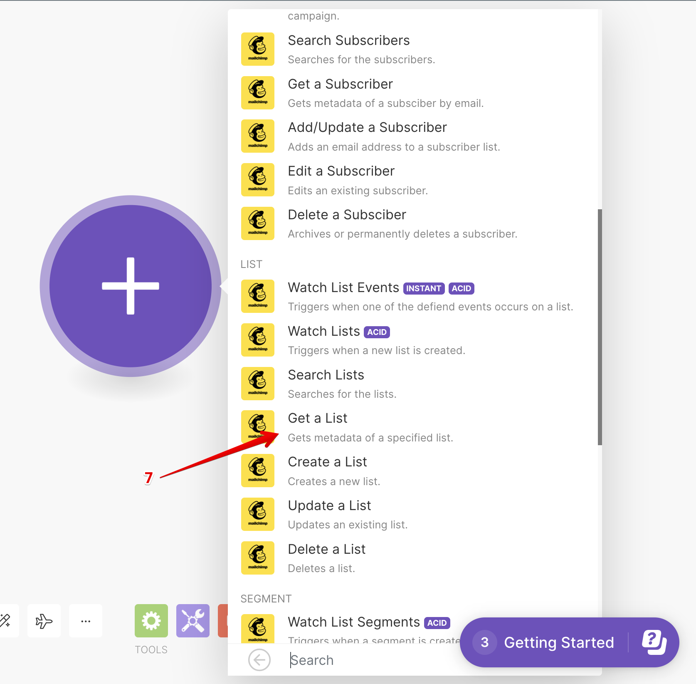
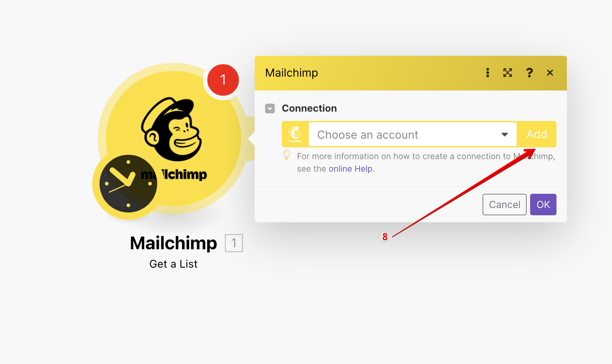
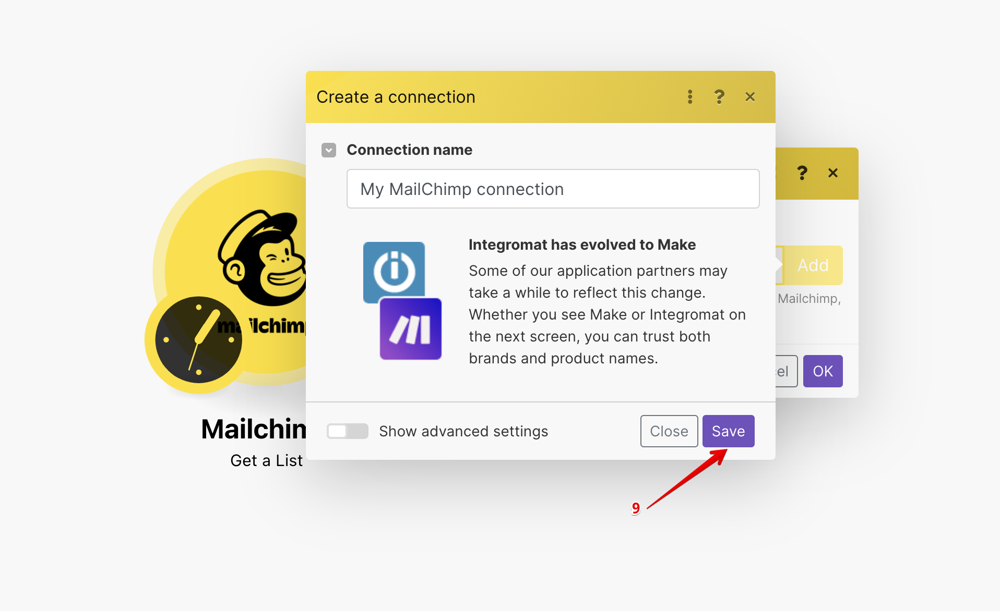

# **{title}**

## {snippet}

### Step 1

- Click “Connect”

### Step 2

- Choose “Install”

### Step 3

- Checkbox “My Organization” and click Install

### Step 4

### Step 5

### Step 6

### Step 7

### Step 8

### Step 9

### Step 10

### Step 11

### Step 12

### Step 13

### Step 14

### Step 15

### Step 16

### Step 17

### Step 18

### Step 19

### Step 20

### Step 21

### Step 22

### Step 23

### Step 24

### Step 25

### Step 26

### Step 27

### Step 28

### Step 29

### Step 30

### Step 31

### Step 32

- Open your Mailchimp account to view the results.

### Step 33

- It’s one of the examples of the usage between (Mailchimp+Mailcheck) and you can generate the same with other apps.

